<div align="center">

<a href="https://github.com/coseto6125">
  
</a>

### Everything No Reason

### Building reliable tools for code intelligence and agent workflows.

[](https://github.com/coseto6125)
[](https://cute-route-dd0.notion.site/2b97a24cf6408090bfe2c6403dedee74?v=2b97a24cf64080449e7e000cb08563f0)
[](https://github.com/coseto6125)

</div>

> I build the connective tissue between software systems and language models: structured context, reliable tools, and interfaces that help agents make better decisions.

My work sits at the intersection of **code intelligence**, **agent-facing infrastructure**, and **production-minded open source**. I care about systems that are fast enough to use interactively, explicit about what they do not know, and shaped around the next decision a developer or an agent needs to make.

## Signal over noise

```text
┌─ DESIGN PRINCIPLES ───────────────────────────────────────────────────────┐
│  structured context  →  give the agent the right graph, not a raw dump    │
│  honest unknowns     →  expose uncertainty instead of inventing edges    │
│  low-friction tools  →  stateless, composable, easy to invoke             │
│  measurable systems  →  benchmark the claim, document the conditions     │
└───────────────────────────────────────────────────────────────────────────┘
```

## Selected work

### [EgentCodePlexus](https://github.com/coseto6125/egent-code-plexus)

**A structural code graph built for AI agents, not humans.**

A Rust-based code intelligence system for structural queries, impact analysis, route maps, cross-repository contracts, and agent-oriented code navigation. It uses compact TOON／JSON output, zero-copy graph access, incremental indexing, and explicit **BlindSpot** records when static analysis cannot establish an edge.

`Rust` `Tree-sitter` `rkyv` `mmap` `Tantivy` `Graph Analysis` `MCP`

| Signal | Public benchmark |
| --- | --- |
| Indexing | 22k files indexed in 2.6 s |
| Querying | Any query answered in under 175 ms in the published workload |
| Coverage | 31 languages across application, infrastructure, data, and contract layers |
| Reliability | Unknown relationships are represented explicitly rather than guessed |

### [Price Compare MCP](https://github.com/coseto6125/mcp-taiwan-price-compare)

**Turning real-world web data into a composable tool for AI workflows.**

A FastMCP server that compares products across 14 Taiwan e-commerce platforms. The interface is intentionally small—one `compare_prices` tool with expressive filters—while the implementation handles asynchronous retrieval, platform differences, test fixtures, CI gates, and token-efficient TOON responses.

`Python` `FastMCP` `Async I/O` `msgspec` `TOON` `Data Integration`

| Mode | Intended use |
| --- | --- |
| `full` | Broad coverage across 14 platforms, approximately 2 seconds |
| `fast` | Lower-latency search across a selected set of platforms, approximately 0.5 seconds |

### [websocket-rs](https://github.com/coseto6125/websocket-rs) · [pyci-check](https://github.com/coseto6125/pyci-check)

Two smaller projects exploring the same theme from different angles: moving performance-sensitive paths into Rust while keeping Python interfaces practical, and making CI／hook feedback fast enough to become part of the normal development loop.

## What I enjoy building

- **Agent interfaces:** MCP servers, compact tool outputs, context shaping, and workflows that are useful without requiring a human-oriented UI.
- **Code intelligence:** AST parsing, structural graphs, dependency and impact analysis, route／contract discovery, and explainable analysis boundaries.
- **Systems engineering:** Rust／Python boundaries, zero-copy data paths, incremental computation, concurrency, packaging, and release automation.
- **Engineering quality:** reproducible benchmarks, meaningful tests, CI that actually validates the intended surface, and documentation that states limitations clearly.

## Tools of the trade

<div align="center">


</div>

<div align="center">

[](https://github.com/coseto6125)
[](https://github.com/coseto6125)

</div>


## Currently thinking about

How can developer tools expose more useful structure to an agent while remaining honest, composable, and cheap to run? The answer usually lives somewhere between the parser, the protocol, and the shape of the output.

<div align="center">

[Explore my repositories](https://github.com/coseto6125?tab=repositories) · [Read my notes](https://cute-route-dd0.notion.site/2b97a24cf6408090bfe2c6403dedee74?v=2b97a24cf64080449e7e000cb08563f0)

</div>

<div align="center">

<sub>Build systems that make the next decision easier.</sub>

</div>
